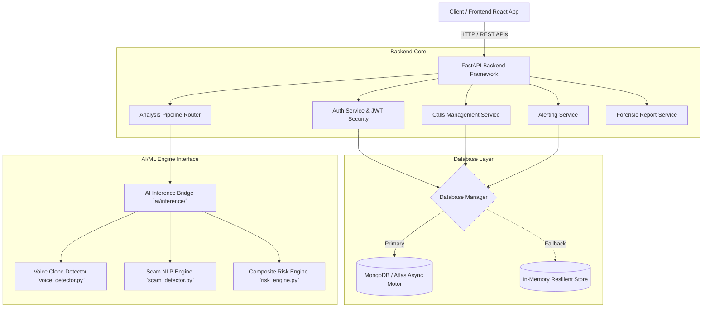
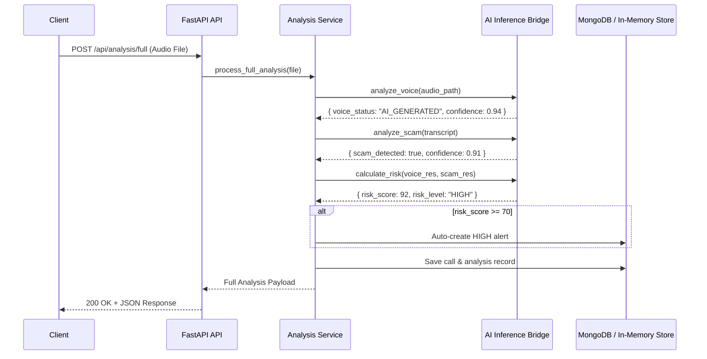

# System Architecture — AI Voice Fraud Detection & Prevention System

## 1. System Overview

The **AI Voice Fraud Detection & Prevention System** is an end-to-end platform engineered to analyze incoming voice calls in real time or via batch upload, detect synthetic/cloned audio (deepfakes), identify fraudulent intent in speech transcripts (scam NLP), and generate unified risk assessment reports and high-priority security alerts.

---

## 2. Core Components

### 2.1 Backend Framework (FastAPI)
- **Asynchronous Execution**: Powered by `asyncio` and `uvicorn` for high-throughput HTTP handling.
- **Pydantic Schemas**: Strict runtime validation of request data and deterministic JSON serialization of response structures.
- **Dependency Injection**: Modular auth extraction (`get_current_user`) and database session injection.

### 2.2 Security & Authentication
- **Password Hashing**: Direct `bcrypt` password hashing with salt generation (avoiding external passlib wrappers).
- **Session Tokens**: Cryptographically signed JSON Web Tokens (JWT) using `HS256` HMAC-SHA256 signature.
- **Protected Routes**: HTTP Bearer authorization headers enforced on call management, alert modification, and report generation endpoints.

### 2.3 Database Layer & Resilience Architecture
- **Dual-Layer Database Client**:
  - **Primary**: Async Motor driver connecting to MongoDB (local or MongoDB Atlas).
  - **Fallback**: In-memory thread-safe dictionary store active whenever MongoDB is unreachable.
- **Indexing**: Unique index on user `email`, index on call `user_id` & `created_at`, and index on alert `user_id` & `status`.

### 2.4 AI Inference Bridge (`ai/inference/`)
The backend decouples API routing from machine learning execution via an abstract bridge interface:
1. **`voice_detector.py`**: Accepts audio file paths and returns synthetic audio detection results (`REAL`, `AI_GENERATED`, `UNKNOWN`) with confidence scores.
2. **`scam_detector.py`**: Performs natural language processing on speech transcripts to flag scam triggers (urgency, OTP requests, financial threats).
3. **`risk_engine.py`**: Combines voice confidence, scam confidence, and pattern heuristics into a single composite risk score (`0-100`) and level (`LOW`, `MEDIUM`, `HIGH`).

---

## 3. Data Schemas

### User Schema
| Field | Type | Description |
|-------|------|-------------|
| `id` | String / PyObjectId | Unique user identifier |
| `email` | String (Unique) | User email address |
| `hashed_password` | String | Bcrypt password hash |
| `full_name` | String | Full name |
| `phone` | String (Optional) | User contact number |
| `created_at` | DateTime | Account creation timestamp |

### Call Schema
| Field | Type | Description |
|-------|------|-------------|
| `id` | String / PyObjectId | Unique call record identifier |
| `user_id` | String | Owner user ID |
| `filename` | String | Saved audio file basename |
| `file_path` | String | Absolute disk path to stored audio |
| `file_size` | Integer | Audio file size in bytes |
| `duration_seconds` | Float | Calculated audio length |
| `status` | String | Status (`UPLOADED`, `PROCESSING`, `ANALYZED`) |
| `caller_number` | String (Optional) | Originating phone number |
| `receiver_number` | String (Optional) | Destination phone number |
| `analysis` | Object (Optional) | Nested full analysis result |
| `created_at` | DateTime | Creation timestamp |

### Alert Schema
| Field | Type | Description |
|-------|------|-------------|
| `id` | String / PyObjectId | Unique alert identifier |
| `user_id` | String | Target user ID |
| `call_id` | String | Linked call ID |
| `risk_level` | String | `LOW`, `MEDIUM`, `HIGH` |
| `risk_score` | Integer | Composite risk rating `0-100` |
| `message` | String | Alert alert description |
| `status` | String | Lifecycle status (`UNREAD`, `ACKNOWLEDGED`, `RESOLVED`) |
| `created_at` | DateTime | Alert timestamp |
